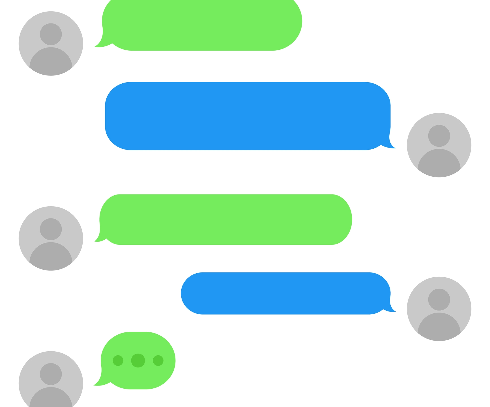
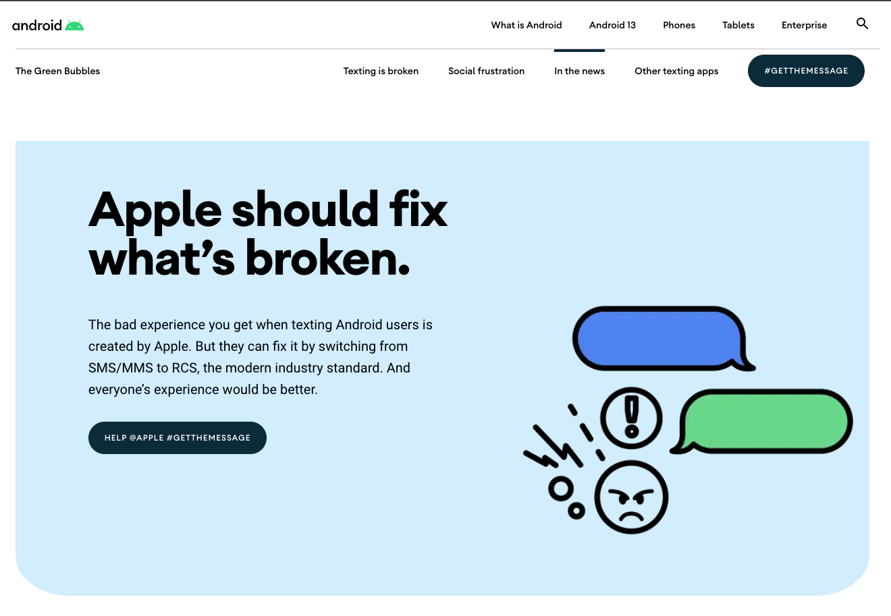

# Unintended Consequences 
*Green Bubbles in iPhone Messages*

We have all dealt with this. In an iPhone group chat, messages appears blue, except anyone who with an Android phone.

 

Apple has optimized for a communication standard among devices they create, blue signifies you are communicating through the iMessage protocol with another apple device. Green means you are communicating through MMS or SMS. Their choice to signify which protocol is being used by color has created unintentional harm.

This has created a new status simple, the blue bubble. Many people, and especially teens, see Android phones as being cheap and inferior compared, there for the green bubble of an Android user can be infer a low "cool" factor or even social-economic status in a group chat, now distilled into a simple color binary.

I have seen and heard students being low-key bullied about this at school. "What is that an Android?" "Android sucks!" "What's with that crappy phone?" 

[Fast Company](https://www.fastcompany.com/90391587/why-we-dont-want-you-and-your-android-green-bubbles-in-our-imessage-chat) has reported about students being left off of groups chats because they turn the group chat green.

But the problem is bigger than just Apple's color choices.

For Android users, it feels more than just an annoyance. In a group chat, Android users experience bad image/video quality and being left of messages. 

There is a solution: the companies could collaborate on an new standard called Rich Communication Services (RCS) to replace MMS. This would allow mobile users to communicate without barriers between the two mobile OS's, but Apple seems to have little incentive to change.

And the thing is Apple's neglect in changing this is likely a bottom line decision. As reported in a Business Insider [article](https://www.businessinsider.com/apple-no-incentive-change-green-bubbles-android-blue-texts-iphones-2022-8) apple has considered making an iMessages app for Android, but they fear that users might be more willing to switch to an Android phone if the colors were the same.

Google recently launched an [ad campaign](https://www.android.com/get-the-message/#green-bubbles-outrage) to put pressure on Apple. 
 
 

On a personal level, I recently switched to an iPhone from a Google pixel because I felt like I was missing out on some social interactions because of my choice of mobile os!

Here is the first message I sent with my new phone!

Honestly, the phone cost nearly two times what my Pixel did, costs me more each month in data because it is a hog, and I like iOS less than Android. Even with all that, I probably won't switch back in part because of green bubbles!

I see this as an ethical issue because Apple's design decisions and unwillingness to adopt to a new communication standard is having real world effects. I've seen it with my students, and felt it myself.

 
